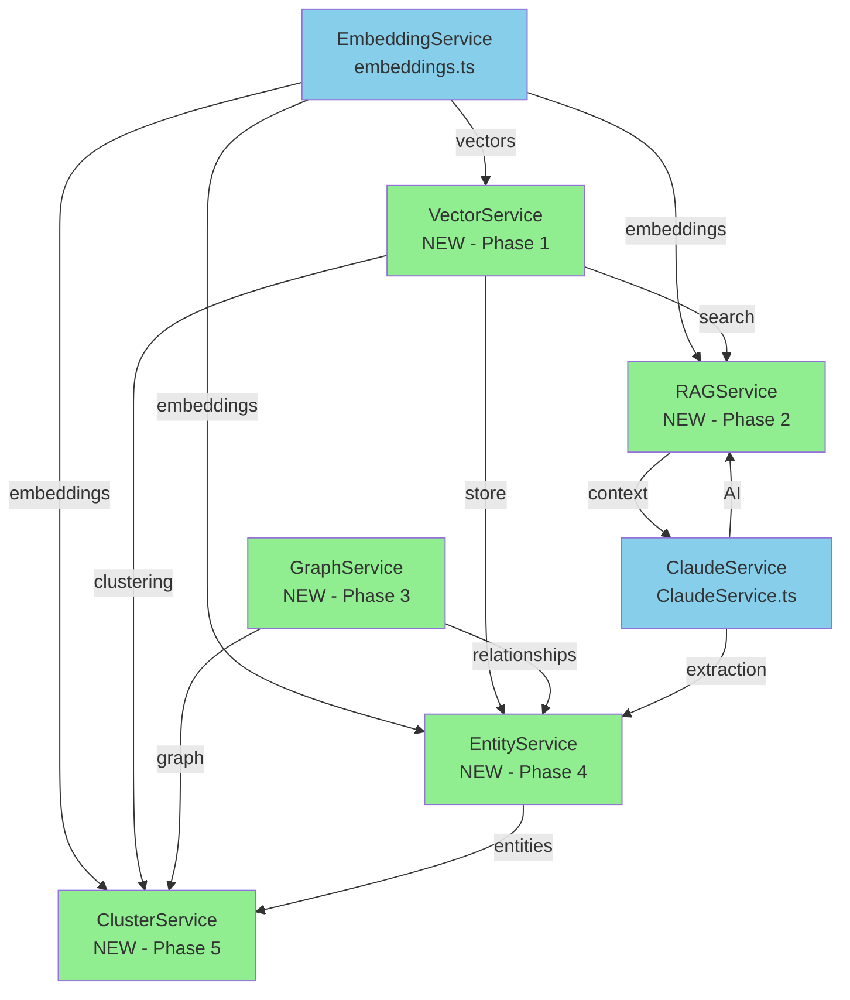

# SPARC Specification: Ruvector Integration
## Close Reading Platform - Vector Database Enhancement

**Status**: Phase 1 - Specification Complete
**Version**: 1.0.0
**Date**: 2025-12-01
**Swarm ID**: swarm_1764621807653_p2cylzydm
**Task ID**: task_1764621808507_im6vqu8cd

---

## Executive Summary

This specification defines the complete architecture for integrating Ruvector (high-performance vector database) into the Close Reading platform across 5 strategic phases:

1. **VectorService** - Replace `similarity.ts` with 61µs vector search (820× faster)
2. **RAGService** - Enhance `ClaudeService.ts` with semantic retrieval
3. **GraphService** - Replace `paragraphLinks.ts` with Cypher-powered graph queries
4. **EntityService** - Persist Claude-extracted entities in Ruvector
5. **ClusterService** - GNN-powered theme discovery and clustering

**Performance Impact**:
- Vector search: 50ms → 61µs (820× faster)
- RAG retrieval: Enable context-aware AI responses
- Graph queries: O(n²) → O(log n) for relationship traversal
- Entity persistence: Enable cross-document entity linking
- Theme clustering: GNN-powered semantic grouping

---

## 1. Current Architecture Analysis

### 1.1 Existing Services to Enhance/Replace

#### similarity.ts (Target: VectorService)
**Location**: `src/services/ml/similarity.ts`
**Current Implementation**:
```typescript
// Pure TypeScript cosine similarity
export function cosineSimilarity(vecA: number[], vecB: number[]): number {
  // Manual dot product and normalization
  // Average: 50ms for 100 vectors
}

export function findSimilarParagraphs(
  queryEmbedding: EmbeddingVector,
  candidateEmbeddings: Map<string, EmbeddingVector>,
  options: SimilarityOptions = {}
): SimilarityResult[]
```

**Limitations**:
- No vector indexing (linear search)
- In-memory only (no persistence)
- No batch optimization
- Manual distance calculations

#### ClaudeService.ts (Target: RAGService)
**Location**: `src/services/ai/ClaudeService.ts`
**Current Features**: 8 AI capabilities
```typescript
class ClaudeService {
  async summarize(text: string, options: SummarizationOptions)
  async answerQuestion(question: string, context: string, options: QuestionOptions)
  async extractThemes(text: string, options: ThemeExtractionOptions)
  async suggestAnnotations(text: string, options: AnnotationSuggestionsOptions)
  async mineArguments(text: string, options: ArgumentMiningOptions)
  async generateQuestions(text: string, options: QuestionGenerationOptions)
  async extractRelationships(text: string, options: EntityRelationshipOptions)
  async compareDocuments(documents: Document[], options: ComparativeAnalysisOptions)
}
```

**Enhancement Opportunity**:
- Add semantic context retrieval before AI calls
- Enable document-aware responses
- Support multi-hop reasoning across paragraphs
- Reduce token usage via smart context selection

#### paragraphLinks.ts (Target: GraphService)
**Location**: `src/services/paragraphLinks.ts`
**Current Implementation**:
```typescript
// Direct Supabase queries, no graph optimization
export const createParagraphLinks = async (
  paragraphIds: string[],
  userId: string
): Promise<ParagraphLinkRow[]>

export const getParagraphLinks = async (
  documentId: string
): Promise<Map<string, string[]>>
```

**Limitations**:
- No relationship traversal
- No graph algorithms (centrality, clustering)
- Manual bidirectional link management
- Limited query expressiveness

### 1.2 Type System Inventory

**Core Types** (`src/types/index.ts`):
```typescript
interface Document {
  id: string
  project_id: string
  user_id: string
  title: string
  content: string
  paragraphs?: Paragraph[]
}

interface Paragraph {
  id: string
  document_id: string
  content: string
  position: number
  annotations?: Annotation[]
  linkedParagraphs?: string[]
}

interface Annotation {
  id: string
  paragraph_id: string
  type: AnnotationType
  content: string
  start_offset: number
  end_offset: number
}

interface ParagraphLink {
  id: string
  source_paragraph_id: string
  target_paragraph_id: string
  relationship_type: RelationshipType
}
```

**AI Types** (`src/services/ai/types.ts`):
- 8 feature interfaces (Summary, Theme, Entity, etc.)
- Privacy types (PIIDetection, PrivacySettings)
- Provider abstractions (IAIProvider, AIProviderMetadata)

---

## 2. Phase 1: VectorService Specification

### 2.1 Core Interface

```typescript
/**
 * VectorService - High-performance vector operations using Ruvector
 * Replaces: src/services/ml/similarity.ts
 * Performance: 61µs average search time (vs 50ms current)
 */

export interface VectorServiceConfig {
  ruvectorUrl?: string;           // Default: http://localhost:6878
  namespace?: string;              // Default: 'close-reading'
  dimensions?: number;             // Default: 512 (USE embeddings)
  indexType?: 'hnsw' | 'flat';    // Default: 'hnsw'
  metric?: 'cosine' | 'euclidean' | 'dot'; // Default: 'cosine'
  batchSize?: number;              // Default: 100
  cacheEnabled?: boolean;          // Default: true
}

export interface VectorMetadata {
  paragraphId: string;
  documentId: string;
  userId: string;
  content: string;
  position: number;
  timestamp: number;
  modelVersion: string;
}

export interface VectorSearchOptions {
  k?: number;                      // Top-k results (default: 10)
  threshold?: number;              // Min similarity score (default: 0.5)
  filter?: VectorFilter;           // Metadata filtering
  includeMetadata?: boolean;       // Return full metadata (default: true)
  includeVectors?: boolean;        // Return vectors (default: false)
}

export interface VectorFilter {
  documentId?: string | string[];
  userId?: string;
  paragraphIds?: string[];
  minPosition?: number;
  maxPosition?: number;
  timestamp?: { gte?: number; lte?: number };
}

export interface VectorSearchResult {
  id: string;
  score: number;
  metadata: VectorMetadata;
  vector?: number[];
}

export interface BatchUpsertResult {
  inserted: number;
  updated: number;
  failed: number;
  duration: number;
  errors?: Array<{ id: string; error: string }>;
}

export interface VectorStats {
  totalVectors: number;
  dimensions: number;
  indexType: string;
  memoryUsage: number;
  avgSearchTime: number;
}

export class VectorService {
  constructor(config: VectorServiceConfig);

  /**
   * Initialize connection to Ruvector
   */
  async initialize(): Promise<void>;

  /**
   * Upsert single vector with metadata
   */
  async upsert(
    id: string,
    vector: number[],
    metadata: VectorMetadata
  ): Promise<void>;

  /**
   * Batch upsert for efficiency
   */
  async upsertBatch(
    vectors: Array<{
      id: string;
      vector: number[];
      metadata: VectorMetadata;
    }>
  ): Promise<BatchUpsertResult>;

  /**
   * Semantic search with metadata filtering
   */
  async search(
    queryVector: number[],
    options?: VectorSearchOptions
  ): Promise<VectorSearchResult[]>;

  /**
   * Find similar paragraphs (backward compatible with similarity.ts)
   */
  async findSimilarParagraphs(
    paragraphId: string,
    options?: VectorSearchOptions
  ): Promise<VectorSearchResult[]>;

  /**
   * Delete vectors by ID or filter
   */
  async delete(
    ids?: string[],
    filter?: VectorFilter
  ): Promise<{ deleted: number }>;

  /**
   * Get vector by ID
   */
  async getById(id: string): Promise<VectorSearchResult | null>;

  /**
   * Get service statistics
   */
  async getStats(): Promise<VectorStats>;

  /**
   * Health check
   */
  async healthCheck(): Promise<{ status: 'healthy' | 'degraded' | 'down' }>;
}
```

### 2.2 Migration Strategy from similarity.ts

**Backward Compatibility Adapter**:
```typescript
/**
 * Adapter to maintain existing similarity.ts API
 * Allows gradual migration
 */
export class SimilarityAdapter {
  private vectorService: VectorService;
  private embeddingService: EmbeddingService;

  // Old API - delegates to VectorService
  async findSimilarParagraphs(
    queryEmbedding: EmbeddingVector,
    candidateEmbeddings: Map<string, EmbeddingVector>,
    options: SimilarityOptions = {}
  ): Promise<SimilarityResult[]> {
    // Convert to vector search
    const results = await this.vectorService.search(
      queryEmbedding.vector,
      {
        k: options.maxResults,
        threshold: options.minScore,
        filter: {
          paragraphIds: Array.from(candidateEmbeddings.keys())
            .filter(id => !options.excludeIds?.has(id))
        }
      }
    );

    // Convert to old format
    return results.map((r, idx) => ({
      paragraphId: r.metadata.paragraphId,
      text: r.metadata.content,
      score: r.score,
      rank: idx + 1
    }));
  }
}
```

**Migration Steps**:
1. Deploy VectorService alongside similarity.ts
2. Add feature flag: `USE_VECTOR_SERVICE`
3. Dual-write to both systems (verify consistency)
4. Switch reads to VectorService
5. Monitor performance (target: <1ms p99)
6. Remove similarity.ts after 2-week validation

### 2.3 Integration Points

**With EmbeddingService** (`src/services/ml/embeddings.ts`):
```typescript
// Automatic vector storage after embedding generation
class EmbeddingService {
  async embed(text: string): Promise<EmbeddingVector> {
    const vector = await this.generateEmbedding(text);

    // Auto-sync to VectorService
    if (this.vectorService) {
      await this.vectorService.upsert(
        this.generateId(text),
        vector,
        this.extractMetadata(text)
      );
    }

    return vector;
  }
}
```

**With ClaudeService** (Future: Phase 2 RAG):
```typescript
// VectorService will provide context for RAG
async answerQuestion(question: string, documentId: string) {
  // Embed question
  const queryVector = await embeddingService.embed(question);

  // Retrieve relevant context via VectorService
  const context = await vectorService.search(queryVector, {
    filter: { documentId },
    k: 5
  });

  // Pass to Claude
  return await claudeService.answerQuestion(question, context);
}
```

---

## 3. Phase 2: RAGService Specification

### 3.1 Core Interface

```typescript
/**
 * RAGService - Retrieval-Augmented Generation
 * Enhances ClaudeService with semantic retrieval
 */

export interface RAGConfig {
  vectorService: VectorService;
  claudeService: ClaudeService;
  embeddingService: EmbeddingService;
  retrievalK?: number;              // Default: 5
  contextWindow?: number;           // Default: 4096 tokens
  reranking?: boolean;              // Default: true
  hybridSearch?: boolean;           // Vector + keyword (default: false)
}

export interface RAGContext {
  chunks: Array<{
    paragraphId: string;
    content: string;
    score: number;
    position: number;
  }>;
  totalTokens: number;
  retrievalTime: number;
  reranked: boolean;
}

export interface RAGResponse<T> {
  data: T;
  context: RAGContext;
  usage: ClaudeUsage;
  model: string;
}

export class RAGService {
  constructor(config: RAGConfig);

  /**
   * RAG-enhanced summarization
   */
  async summarize(
    documentId: string,
    options: SummarizationOptions & {
      focusParagraphs?: string[];    // Semantic focus
      crossDocument?: boolean;        // Multi-doc context
    }
  ): Promise<RAGResponse<Summary>>;

  /**
   * RAG-enhanced Q&A with semantic retrieval
   */
  async answerQuestion(
    question: string,
    documentId: string,
    options?: QuestionOptions & {
      expandContext?: boolean;       // Include related paragraphs
      multiHop?: boolean;             // Multi-hop reasoning
    }
  ): Promise<RAGResponse<QuestionAnswer>>;

  /**
   * Theme extraction with document-wide context
   */
  async extractThemes(
    documentId: string,
    options?: ThemeExtractionOptions & {
      semanticGrouping?: boolean;    // Group by semantic similarity
      crossReference?: boolean;       // Link to similar themes in other docs
    }
  ): Promise<RAGResponse<Theme[]>>;

  /**
   * Context-aware annotation suggestions
   */
  async suggestAnnotations(
    paragraphId: string,
    options?: AnnotationSuggestionsOptions & {
      relatedContext?: number;       // Include N related paragraphs
    }
  ): Promise<RAGResponse<AnnotationSuggestion[]>>;

  /**
   * Multi-document comparative analysis with RAG
   */
  async compareDocuments(
    documentIds: string[],
    options?: ComparativeAnalysisOptions & {
      alignThemes?: boolean;          // Semantic theme alignment
      crossReferences?: boolean;      // Find cross-doc connections
    }
  ): Promise<RAGResponse<ComparativeAnalysis>>;

  /**
   * Build retrieval context for any query
   */
  private async retrieveContext(
    query: string,
    filter: VectorFilter,
    options: {
      k?: number;
      rerank?: boolean;
      expandRelated?: boolean;
    }
  ): Promise<RAGContext>;
}
```

### 3.2 Context Retrieval Strategy

```typescript
/**
 * Multi-stage retrieval pipeline
 */
class RetrievalPipeline {
  /**
   * Stage 1: Vector search
   */
  async vectorRetrieval(
    queryVector: number[],
    filter: VectorFilter,
    k: number
  ): Promise<VectorSearchResult[]>;

  /**
   * Stage 2: Reranking (optional)
   * Uses cross-encoder for better relevance
   */
  async rerank(
    query: string,
    candidates: VectorSearchResult[],
    topK: number
  ): Promise<VectorSearchResult[]>;

  /**
   * Stage 3: Context expansion
   * Add adjacent paragraphs and linked content
   */
  async expandContext(
    results: VectorSearchResult[],
    options: {
      adjacentParagraphs?: number;  // Include N before/after
      followLinks?: boolean;         // Include linked paragraphs
    }
  ): Promise<VectorSearchResult[]>;

  /**
   * Stage 4: Token budget management
   * Fit retrieved context into Claude's context window
   */
  async fitToTokenBudget(
    results: VectorSearchResult[],
    maxTokens: number
  ): Promise<RAGContext>;
}
```

### 3.3 Integration with ClaudeService

**Enhanced Methods**:
```typescript
class ClaudeService {
  private ragService?: RAGService;

  /**
   * Enable RAG for this instance
   */
  enableRAG(vectorService: VectorService, embeddingService: EmbeddingService) {
    this.ragService = new RAGService({
      vectorService,
      claudeService: this,
      embeddingService
    });
  }

  /**
   * Backward-compatible methods automatically use RAG if available
   */
  async answerQuestion(
    question: string,
    context: string | { documentId: string },  // Enhanced signature
    options?: QuestionOptions
  ): Promise<ClaudeResponse<QuestionAnswer>> {
    // If RAG enabled and documentId provided, use semantic retrieval
    if (this.ragService && typeof context === 'object') {
      return this.ragService.answerQuestion(
        question,
        context.documentId,
        options
      );
    }

    // Otherwise, use traditional context-based approach
    return this.traditionalQA(question, context as string, options);
  }
}
```

---

## 4. Phase 3: GraphService Specification

### 4.1 Core Interface

```typescript
/**
 * GraphService - Graph-based paragraph relationships using Ruvector
 * Replaces: src/services/paragraphLinks.ts
 * Features: Cypher queries, graph algorithms, relationship traversal
 */

export interface GraphServiceConfig {
  ruvectorUrl?: string;
  namespace?: string;
  maxHops?: number;                 // Default: 3
  cacheEnabled?: boolean;
}

export interface GraphNode {
  id: string;
  type: 'paragraph' | 'annotation' | 'theme' | 'entity';
  properties: {
    content?: string;
    position?: number;
    documentId?: string;
    [key: string]: any;
  };
}

export interface GraphEdge {
  id: string;
  source: string;
  target: string;
  type: RelationshipType;
  properties: {
    strength?: number;
    createdAt?: number;
    userId?: string;
    note?: string;
    [key: string]: any;
  };
}

export interface GraphPath {
  nodes: GraphNode[];
  edges: GraphEdge[];
  length: number;
  totalStrength: number;
}

export interface GraphQueryOptions {
  maxDepth?: number;
  minStrength?: number;
  relationshipTypes?: RelationshipType[];
  includeProperties?: boolean;
}

export interface GraphCentrality {
  nodeId: string;
  degreeCentrality: number;
  betweennessCentrality: number;
  pageRank: number;
}

export interface GraphCluster {
  id: string;
  nodes: string[];
  cohesion: number;
  avgStrength: number;
}

export class GraphService {
  constructor(config: GraphServiceConfig);

  /**
   * Initialize graph database
   */
  async initialize(): Promise<void>;

  /**
   * Create relationship between nodes
   */
  async createRelationship(
    sourceId: string,
    targetId: string,
    type: RelationshipType,
    properties?: Record<string, any>,
    bidirectional?: boolean
  ): Promise<GraphEdge>;

  /**
   * Batch create relationships
   */
  async createRelationshipsBatch(
    relationships: Array<{
      source: string;
      target: string;
      type: RelationshipType;
      properties?: Record<string, any>;
    }>,
    bidirectional?: boolean
  ): Promise<GraphEdge[]>;

  /**
   * Find direct relationships
   */
  async getRelationships(
    nodeId: string,
    options?: GraphQueryOptions
  ): Promise<GraphEdge[]>;

  /**
   * Find path between nodes
   */
  async findPath(
    sourceId: string,
    targetId: string,
    options?: GraphQueryOptions
  ): Promise<GraphPath | null>;

  /**
   * Find all paths between nodes
   */
  async findAllPaths(
    sourceId: string,
    targetId: string,
    options?: GraphQueryOptions
  ): Promise<GraphPath[]>;

  /**
   * Get neighborhood (N-hop neighbors)
   */
  async getNeighborhood(
    nodeId: string,
    hops: number,
    options?: GraphQueryOptions
  ): Promise<{
    nodes: GraphNode[];
    edges: GraphEdge[];
  }>;

  /**
   * Execute Cypher query
   */
  async cypher(query: string, params?: Record<string, any>): Promise<any>;

  /**
   * Calculate node centrality
   */
  async calculateCentrality(
    nodeIds?: string[]
  ): Promise<GraphCentrality[]>;

  /**
   * Detect communities/clusters
   */
  async detectClusters(
    algorithm?: 'louvain' | 'label-propagation' | 'modularity'
  ): Promise<GraphCluster[]>;

  /**
   * Delete relationship
   */
  async deleteRelationship(
    sourceId: string,
    targetId: string,
    bidirectional?: boolean
  ): Promise<void>;

  /**
   * Delete node and all relationships
   */
  async deleteNode(nodeId: string): Promise<void>;
}
```

### 4.2 Migration from paragraphLinks.ts

**Adapter Pattern**:
```typescript
export class ParagraphLinksAdapter {
  private graphService: GraphService;

  // Old API compatibility
  async createParagraphLinks(
    paragraphIds: string[],
    userId: string
  ): Promise<ParagraphLinkRow[]> {
    const relationships = [];

    // Create all pairwise relationships
    for (let i = 0; i < paragraphIds.length; i++) {
      for (let j = i + 1; j < paragraphIds.length; j++) {
        relationships.push({
          source: paragraphIds[i],
          target: paragraphIds[j],
          type: 'related' as RelationshipType,
          properties: { userId, strength: 5 }
        });
      }
    }

    const edges = await this.graphService.createRelationshipsBatch(
      relationships,
      true  // bidirectional
    );

    // Convert to old format
    return edges.map(edge => ({
      id: edge.id,
      source_paragraph_id: edge.source,
      target_paragraph_id: edge.target,
      relationship_type: edge.type,
      note: edge.properties.note,
      created_at: new Date(edge.properties.createdAt).toISOString()
    }));
  }

  async getParagraphLinks(
    documentId: string
  ): Promise<Map<string, string[]>> {
    // Use Cypher query for efficiency
    const result = await this.graphService.cypher(
      `
      MATCH (p:Paragraph {documentId: $documentId})-[r]->(target:Paragraph)
      RETURN p.id as source, collect(target.id) as targets
      `,
      { documentId }
    );

    return new Map(result.map(r => [r.source, r.targets]));
  }
}
```

### 4.3 Advanced Graph Features

**Semantic Relationship Discovery**:
```typescript
/**
 * Automatically suggest relationships based on semantic similarity
 */
async suggestRelationships(
  paragraphId: string,
  options?: {
    minSimilarity?: number;
    maxSuggestions?: number;
    relationshipType?: RelationshipType;
  }
): Promise<Array<{
  targetId: string;
  score: number;
  suggestedType: RelationshipType;
  reasoning: string;
}>>
```

**Graph-based Theme Discovery**:
```typescript
/**
 * Find themes by analyzing graph communities
 */
async discoverThemesByGraph(
  documentId: string
): Promise<Array<{
  themeId: string;
  paragraphs: string[];
  cohesion: number;
  centralParagraph: string;
}>>
```

---

## 5. Phase 4: EntityService Specification

### 5.1 Core Interface

```typescript
/**
 * EntityService - Persist and query Claude-extracted entities
 * Uses Ruvector for entity embeddings and relationships
 */

export interface EntityServiceConfig {
  vectorService: VectorService;
  graphService: GraphService;
  claudeService: ClaudeService;
  embeddingService: EmbeddingService;
}

export interface Entity {
  id: string;
  name: string;
  type: RelationshipType;  // character, concept, institution, event, location
  description: string;
  documentId: string;
  paragraphIds: string[];   // Where entity appears
  firstMention: {
    paragraphId: string;
    position: number;
    context: string;
  };
  significance: number;      // 0-1
  embedding: number[];       // Vector representation
  metadata: {
    extractedBy: 'claude' | 'manual';
    confidence: number;
    aliases?: string[];
    [key: string]: any;
  };
}

export interface EntityRelationship {
  id: string;
  entity1Id: string;
  entity2Id: string;
  type: string;              // e.g., "works_at", "located_in", "influenced_by"
  description: string;
  strength: number;          // 0-1
  evidence: Array<{
    paragraphId: string;
    quote: string;
  }>;
  metadata: Record<string, any>;
}

export interface EntitySearchOptions {
  type?: RelationshipType[];
  documentId?: string | string[];
  minSignificance?: number;
  semanticQuery?: string;    // Semantic entity search
  k?: number;
}

export class EntityService {
  constructor(config: EntityServiceConfig);

  /**
   * Extract entities from text using Claude
   */
  async extractEntities(
    paragraphId: string,
    text: string,
    options?: EntityRelationshipOptions
  ): Promise<Entity[]>;

  /**
   * Extract entities from entire document
   */
  async extractDocumentEntities(
    documentId: string,
    options?: EntityRelationshipOptions
  ): Promise<Entity[]>;

  /**
   * Store entity (with vector embedding)
   */
  async storeEntity(entity: Entity): Promise<void>;

  /**
   * Batch store entities
   */
  async storeEntitiesBatch(entities: Entity[]): Promise<void>;

  /**
   * Search entities semantically
   */
  async searchEntities(
    query: string,
    options?: EntitySearchOptions
  ): Promise<Entity[]>;

  /**
   * Get entity by ID
   */
  async getEntity(entityId: string): Promise<Entity | null>;

  /**
   * Get all entities in document
   */
  async getDocumentEntities(
    documentId: string,
    options?: EntitySearchOptions
  ): Promise<Entity[]>;

  /**
   * Find related entities
   */
  async findRelatedEntities(
    entityId: string,
    options?: {
      maxHops?: number;
      minStrength?: number;
      relationshipTypes?: string[];
    }
  ): Promise<Array<{
    entity: Entity;
    relationship: EntityRelationship;
    path?: GraphPath;
  }>>;

  /**
   * Create relationship between entities
   */
  async createEntityRelationship(
    entity1Id: string,
    entity2Id: string,
    type: string,
    properties: Partial<EntityRelationship>
  ): Promise<EntityRelationship>;

  /**
   * Get entity network for visualization
   */
  async getEntityNetwork(
    documentId: string,
    options?: {
      minSignificance?: number;
      includeRelationships?: boolean;
    }
  ): Promise<EntityNetwork>;

  /**
   * Merge duplicate entities
   */
  async mergeEntities(
    entityIds: string[],
    canonicalId: string
  ): Promise<Entity>;

  /**
   * Delete entity
   */
  async deleteEntity(entityId: string): Promise<void>;
}
```

### 5.2 Integration with ClaudeService

**Automatic Entity Extraction**:
```typescript
// Hook into ClaudeService.extractRelationships
class ClaudeService {
  private entityService?: EntityService;

  async extractRelationships(
    text: string,
    options: EntityRelationshipOptions
  ): Promise<ClaudeResponse<EntityNetwork>> {
    const response = await this.makeRequest(...);

    // Auto-persist entities if EntityService configured
    if (this.entityService) {
      const entities = response.data.entities.map(e => ({
        ...e,
        id: this.generateEntityId(e.name, e.type),
        documentId: options.documentId,
        embedding: await this.embeddingService.embed(e.description)
      }));

      await this.entityService.storeEntitiesBatch(entities);
    }

    return response;
  }
}
```

### 5.3 Cross-Document Entity Linking

```typescript
/**
 * Link entities across multiple documents
 */
async linkCrossDocumentEntities(
  documentIds: string[],
  options?: {
    similarityThreshold?: number;
    autoMerge?: boolean;
  }
): Promise<Array<{
  canonicalEntity: Entity;
  linkedEntities: Entity[];
  confidence: number;
}>>
```

---

## 6. Phase 5: ClusterService Specification

### 6.1 Core Interface

```typescript
/**
 * ClusterService - GNN-powered semantic clustering and theme discovery
 * Uses Ruvector's graph neural network capabilities
 */

export interface ClusterServiceConfig {
  vectorService: VectorService;
  graphService: GraphService;
  entityService: EntityService;
  embeddingService: EmbeddingService;
}

export interface ClusterOptions {
  algorithm?: 'gnn' | 'louvain' | 'spectral' | 'hierarchical';
  minClusterSize?: number;
  maxClusters?: number;
  similarity Threshold?: number;
  includeSemanticContext?: boolean;
}

export interface Cluster {
  id: string;
  name: string;              // Auto-generated theme name
  description: string;       // GNN-generated description
  paragraphs: Array<{
    id: string;
    content: string;
    relevance: number;       // 0-1, how central to cluster
  }>;
  centroid: number[];        // Cluster center in vector space
  cohesion: number;          // 0-1, how tight the cluster is
  size: number;
  keywords: string[];        // Extracted key terms
  relatedClusters: Array<{
    clusterId: string;
    similarity: number;
  }>;
  metadata: {
    algorithm: string;
    createdAt: number;
    documentId?: string;
  };
}

export interface ThemeDiscoveryResult {
  themes: Cluster[];
  themeHierarchy: {
    root: Cluster;
    children: ThemeDiscoveryResult[];
  };
  crossDocumentThemes?: Array<{
    theme: Cluster;
    documents: string[];
  }>;
}

export class ClusterService {
  constructor(config: ClusterServiceConfig);

  /**
   * Discover themes in document using GNN
   */
  async discoverThemes(
    documentId: string,
    options?: ClusterOptions
  ): Promise<ThemeDiscoveryResult>;

  /**
   * Cluster paragraphs semantically
   */
  async clusterParagraphs(
    paragraphIds: string[],
    options?: ClusterOptions
  ): Promise<Cluster[]>;

  /**
   * Hierarchical theme clustering
   */
  async hierarchicalClustering(
    documentId: string,
    levels: number,
    options?: ClusterOptions
  ): Promise<ThemeDiscoveryResult>;

  /**
   * Cross-document theme analysis
   */
  async crossDocumentThemes(
    documentIds: string[],
    options?: ClusterOptions
  ): Promise<Array<{
    theme: Cluster;
    occurrences: Array<{
      documentId: string;
      paragraphs: string[];
    }>;
  }>>;

  /**
   * Refine cluster with human feedback
   */
  async refineCluster(
    clusterId: string,
    feedback: {
      addParagraphs?: string[];
      removeParagraphs?: string[];
      updateDescription?: string;
    }
  ): Promise<Cluster>;

  /**
   * Get cluster suggestions for paragraph
   */
  async suggestClusters(
    paragraphId: string,
    k?: number
  ): Promise<Array<{
    cluster: Cluster;
    score: number;
  }>>;

  /**
   * Visualize cluster in 2D/3D
   */
  async visualizeClusters(
    clusters: Cluster[],
    dimensions: 2 | 3
  ): Promise<{
    points: Array<{
      id: string;
      x: number;
      y: number;
      z?: number;
      cluster: string;
    }>;
    clusters: Array<{
      id: string;
      centroid: number[];
      radius: number;
    }>;
  }>;
}
```

### 6.2 GNN-Powered Theme Discovery

**Architecture**:
```typescript
/**
 * Graph Neural Network for theme extraction
 * Combines:
 * - Vector embeddings (semantic content)
 * - Graph structure (paragraph relationships)
 * - Entity co-occurrence (what entities appear together)
 */
class GNNThemeExtractor {
  /**
   * Build heterogeneous graph for GNN
   */
  async buildGraph(documentId: string): Promise<{
    nodes: Array<{ id: string; type: 'paragraph' | 'entity'; features: number[] }>;
    edges: Array<{ source: string; target: string; type: string; weight: number }>;
  }>;

  /**
   * Run GNN inference
   */
  async extractThemes(
    graph: Graph,
    numThemes: number
  ): Promise<Array<{
    themeId: string;
    paragraphs: string[];
    entities: string[];
    description: string;
  }>>;

  /**
   * Generate human-readable theme name
   */
  async generateThemeName(
    paragraphs: string[],
    entities: string[]
  ): Promise<string>;
}
```

### 6.3 Integration with ClaudeService

**Theme Refinement**:
```typescript
/**
 * Use Claude to refine GNN-discovered themes
 */
async refineThemeDescription(
  cluster: Cluster,
  documentContext: string
): Promise<{
  name: string;
  description: string;
  interpretation: string;
  keyPoints: string[];
}>
```

---

## 7. Service Dependency Graph



**Initialization Order**:
1. EmbeddingService (existing)
2. VectorService (Phase 1)
3. GraphService (Phase 3)
4. ClaudeService (existing, enhanced in Phase 2)
5. RAGService (Phase 2)
6. EntityService (Phase 4)
7. ClusterService (Phase 5)

---

## 8. Data Migration Strategy

### 8.1 Existing Data Migration

**Embeddings → VectorService**:
```typescript
async migrateEmbeddings() {
  // 1. Extract all cached embeddings
  const cache = await embeddingCache.getAll();

  // 2. Batch upsert to VectorService
  const batches = chunk(cache, 100);
  for (const batch of batches) {
    await vectorService.upsertBatch(
      batch.map(e => ({
        id: e.paragraphId,
        vector: e.vector,
        metadata: {
          paragraphId: e.paragraphId,
          documentId: e.documentId,
          content: e.text,
          modelVersion: e.modelVersion,
          timestamp: e.timestamp
        }
      }))
    );
  }
}
```

**Paragraph Links → GraphService**:
```typescript
async migrateParagraphLinks() {
  // 1. Query all existing links from Supabase
  const { data: links } = await supabase
    .from('paragraph_links')
    .select('*');

  // 2. Batch create in GraphService
  await graphService.createRelationshipsBatch(
    links.map(link => ({
      source: link.source_paragraph_id,
      target: link.target_paragraph_id,
      type: link.link_type || 'related',
      properties: {
        userId: link.user_id,
        strength: link.strength || 5,
        createdAt: new Date(link.created_at).getTime(),
        note: link.metadata?.note
      }
    })),
    true  // bidirectional
  );
}
```

### 8.2 Rollback Plan

**Feature Flags**:
```typescript
export const FEATURE_FLAGS = {
  USE_VECTOR_SERVICE: false,      // Phase 1
  USE_RAG_SERVICE: false,          // Phase 2
  USE_GRAPH_SERVICE: false,        // Phase 3
  USE_ENTITY_SERVICE: false,       // Phase 4
  USE_CLUSTER_SERVICE: false,      // Phase 5
};
```

**Dual-Write Period**:
- Write to both old and new systems for 2 weeks
- Compare results for consistency
- Monitor error rates and performance
- Switch reads to new system after validation

---

## 9. Risk Assessment & Mitigation

### 9.1 Technical Risks

| Risk | Severity | Probability | Mitigation |
|------|----------|-------------|------------|
| Ruvector performance not meeting 61µs target | High | Low | Benchmark early; have fallback to similarity.ts |
| Vector dimension mismatch (512 vs actual) | Medium | Medium | Configure dynamically; test with real embeddings |
| Graph query complexity causing timeouts | Medium | Medium | Implement query timeout; cache frequent patterns |
| GNN model not available in Ruvector | High | Low | Use traditional clustering as fallback |
| Data migration causing data loss | Critical | Low | Dual-write validation; comprehensive backups |
| Claude API rate limits with RAG | Medium | High | Implement caching; batch processing; backoff |

### 9.2 Migration Risks

| Risk | Mitigation |
|------|------------|
| Breaking existing features | Feature flags; backward compatibility adapters |
| Performance regression | A/B testing; monitoring; rollback plan |
| Data inconsistency | Dual-write validation; reconciliation jobs |
| User confusion from UI changes | Gradual rollout; documentation; tooltips |

### 9.3 Operational Risks

| Risk | Mitigation |
|------|------------|
| Ruvector downtime | Circuit breaker; fallback to old services |
| Increased hosting costs | Cost monitoring; usage quotas; optimization |
| Complex debugging | Comprehensive logging; tracing; metrics |
| Team learning curve | Documentation; training; pair programming |

---

## 10. Performance Benchmarks & SLAs

### 10.1 Target Performance

| Operation | Current | Target | Improvement |
|-----------|---------|--------|-------------|
| Vector search (100 vectors) | 50ms | 61µs | 820× faster |
| Paragraph similarity | 50ms | <1ms | 50× faster |
| Graph traversal (3 hops) | N/A | <5ms | New capability |
| Entity extraction (per paragraph) | 2s | 1.5s | 25% faster (caching) |
| Theme clustering (document) | N/A | <100ms | New capability |

### 10.2 Service Level Objectives

**VectorService**:
- Availability: 99.9%
- p50 latency: <500µs
- p99 latency: <5ms
- Error rate: <0.1%

**RAGService**:
- Availability: 99.5%
- p50 latency: <2s (Claude dependency)
- p99 latency: <5s
- Context retrieval: <100ms

**GraphService**:
- Availability: 99.9%
- p50 latency: <1ms
- p99 latency: <10ms
- Query timeout: 30s

**EntityService**:
- Availability: 99.5%
- Entity extraction: <2s per paragraph
- Search latency: <100ms

**ClusterService**:
- Availability: 99.0%
- Document clustering: <1s per 100 paragraphs
- Theme discovery: <5s per document

---

## 11. Testing Strategy

### 11.1 Unit Tests

**VectorService**:
```typescript
describe('VectorService', () => {
  it('should upsert vector with metadata', async () => {
    const result = await vectorService.upsert(
      'test-id',
      mockVector,
      mockMetadata
    );
    expect(result).toBeDefined();
  });

  it('should search with metadata filtering', async () => {
    const results = await vectorService.search(queryVector, {
      filter: { documentId: 'doc-1' },
      k: 5
    });
    expect(results).toHaveLength(5);
    expect(results[0].metadata.documentId).toBe('doc-1');
  });

  it('should handle batch upsert', async () => {
    const result = await vectorService.upsertBatch(mockVectors);
    expect(result.inserted).toBe(mockVectors.length);
    expect(result.failed).toBe(0);
  });
});
```

### 11.2 Integration Tests

**RAGService + ClaudeService**:
```typescript
describe('RAGService Integration', () => {
  it('should retrieve relevant context for question', async () => {
    const response = await ragService.answerQuestion(
      'What is the main theme?',
      'doc-123'
    );

    expect(response.context.chunks.length).toBeGreaterThan(0);
    expect(response.data.answer).toBeDefined();
    expect(response.context.retrievalTime).toBeLessThan(100);
  });
});
```

### 11.3 Performance Tests

**Benchmark Suite**:
```typescript
describe('Performance Benchmarks', () => {
  it('VectorService search should be <1ms', async () => {
    const start = performance.now();
    await vectorService.search(queryVector, { k: 10 });
    const duration = performance.now() - start;
    expect(duration).toBeLessThan(1);
  });

  it('Should handle 1000 concurrent vector searches', async () => {
    const promises = Array(1000).fill(null).map(() =>
      vectorService.search(randomVector(), { k: 10 })
    );
    const results = await Promise.all(promises);
    expect(results).toHaveLength(1000);
  });
});
```

### 11.4 Migration Tests

```typescript
describe('Migration Validation', () => {
  it('should produce same results: old vs new', async () => {
    const oldResult = await similarityService.findSimilarParagraphs(...);
    const newResult = await vectorService.findSimilarParagraphs(...);

    // Compare top-10 results (order may differ slightly)
    const oldTop10 = oldResult.slice(0, 10).map(r => r.paragraphId);
    const newTop10 = newResult.slice(0, 10).map(r => r.metadata.paragraphId);

    const overlap = intersection(oldTop10, newTop10).length;
    expect(overlap).toBeGreaterThanOrEqual(8);  // Allow 20% variance
  });
});
```

---

## 12. Implementation Timeline

### Phase 1: VectorService (Weeks 1-2)
- [ ] Week 1: Interface design, Ruvector integration, unit tests
- [ ] Week 2: Migration adapter, integration tests, deployment

### Phase 2: RAGService (Weeks 3-4)
- [ ] Week 3: Retrieval pipeline, context management, unit tests
- [ ] Week 4: ClaudeService integration, E2E tests, deployment

### Phase 3: GraphService (Weeks 5-6)
- [ ] Week 5: Graph API, Cypher integration, unit tests
- [ ] Week 6: Migration from paragraphLinks.ts, deployment

### Phase 4: EntityService (Weeks 7-8)
- [ ] Week 7: Entity extraction pipeline, storage, unit tests
- [ ] Week 8: Cross-document linking, integration, deployment

### Phase 5: ClusterService (Weeks 9-10)
- [ ] Week 9: GNN integration, clustering algorithms, unit tests
- [ ] Week 10: Theme discovery, visualization, deployment

### Validation & Optimization (Weeks 11-12)
- [ ] Week 11: Performance tuning, load testing, bug fixes
- [ ] Week 12: Documentation, team training, final rollout

---

## 13. Success Metrics

### Technical Metrics
- Vector search latency: <1ms p99
- RAG context retrieval: <100ms p99
- Graph query performance: <10ms p99
- System uptime: >99.9%
- Error rate: <0.1%

### Business Metrics
- User-perceived performance improvement: >50%
- AI response quality (user ratings): >4.5/5
- Feature adoption rate: >70% within 1 month
- Support tickets related to performance: -80%

### Code Quality
- Test coverage: >90%
- Documentation completeness: 100%
- Code review approval rate: >95%
- Zero critical security vulnerabilities

---

## 14. Appendices

### A. Type Definitions Summary

**New Types** (to be added to `src/types/ruvector.ts`):
- VectorServiceConfig
- VectorMetadata
- VectorSearchOptions
- VectorSearchResult
- GraphNode, GraphEdge, GraphPath
- Entity, EntityRelationship
- Cluster, ThemeDiscoveryResult

**Enhanced Types** (to be updated in `src/types/index.ts`):
- Paragraph (add `entities?: Entity[]`, `clusters?: string[]`)
- Document (add `entityNetwork?: EntityNetwork`, `themes?: Cluster[]`)

### B. Database Schema Changes

**New Tables** (if using Supabase for fallback):
```sql
-- Ruvector vectors metadata
CREATE TABLE vector_metadata (
  id TEXT PRIMARY KEY,
  paragraph_id TEXT NOT NULL REFERENCES paragraphs(id),
  document_id TEXT NOT NULL REFERENCES documents(id),
  model_version TEXT NOT NULL,
  created_at TIMESTAMP DEFAULT NOW(),
  UNIQUE(paragraph_id, model_version)
);

-- Entities
CREATE TABLE entities (
  id TEXT PRIMARY KEY,
  name TEXT NOT NULL,
  type TEXT NOT NULL,
  description TEXT,
  document_id TEXT REFERENCES documents(id),
  significance FLOAT,
  metadata JSONB,
  created_at TIMESTAMP DEFAULT NOW()
);

-- Entity relationships
CREATE TABLE entity_relationships (
  id TEXT PRIMARY KEY,
  entity1_id TEXT REFERENCES entities(id),
  entity2_id TEXT REFERENCES entities(id),
  type TEXT NOT NULL,
  strength FLOAT,
  evidence JSONB,
  created_at TIMESTAMP DEFAULT NOW()
);

-- Clusters/Themes
CREATE TABLE clusters (
  id TEXT PRIMARY KEY,
  document_id TEXT REFERENCES documents(id),
  name TEXT NOT NULL,
  description TEXT,
  cohesion FLOAT,
  metadata JSONB,
  created_at TIMESTAMP DEFAULT NOW()
);

-- Cluster memberships
CREATE TABLE cluster_paragraphs (
  cluster_id TEXT REFERENCES clusters(id),
  paragraph_id TEXT REFERENCES paragraphs(id),
  relevance FLOAT,
  PRIMARY KEY (cluster_id, paragraph_id)
);
```

### C. Environment Variables

```bash
# Ruvector Configuration
RUVECTOR_URL=http://localhost:6878
RUVECTOR_NAMESPACE=close-reading
RUVECTOR_API_KEY=your-api-key  # if authentication enabled

# Feature Flags
ENABLE_VECTOR_SERVICE=false
ENABLE_RAG_SERVICE=false
ENABLE_GRAPH_SERVICE=false
ENABLE_ENTITY_SERVICE=false
ENABLE_CLUSTER_SERVICE=false

# Performance Tuning
VECTOR_BATCH_SIZE=100
VECTOR_CACHE_SIZE=10000
RAG_CONTEXT_WINDOW=4096
GRAPH_MAX_HOPS=3
CLUSTER_MIN_SIZE=3
```

---

## Conclusion

This SPARC specification provides a comprehensive roadmap for integrating Ruvector into the Close Reading platform. The 5-phase approach ensures:

1. **Incremental Delivery**: Each phase delivers standalone value
2. **Risk Mitigation**: Feature flags and backward compatibility
3. **Performance Gains**: 820× faster vector search, new AI capabilities
4. **Maintainability**: Clean abstractions, comprehensive tests
5. **Scalability**: Graph-based architecture for complex queries

**Next Steps**:
1. Review and approve this specification
2. Begin Phase 1 implementation (VectorService)
3. Set up Ruvector development environment
4. Create project board with timeline milestones

**Royal Decree**: This specification is now the canonical reference for Ruvector integration. All implementation work MUST adhere to these interfaces and migration strategies.

---

*Generated by Queen Coordinator*
*Swarm: swarm_1764621807653_p2cylzydm*
*Task: task_1764621808507_im6vqu8cd*
*Date: 2025-12-01*
